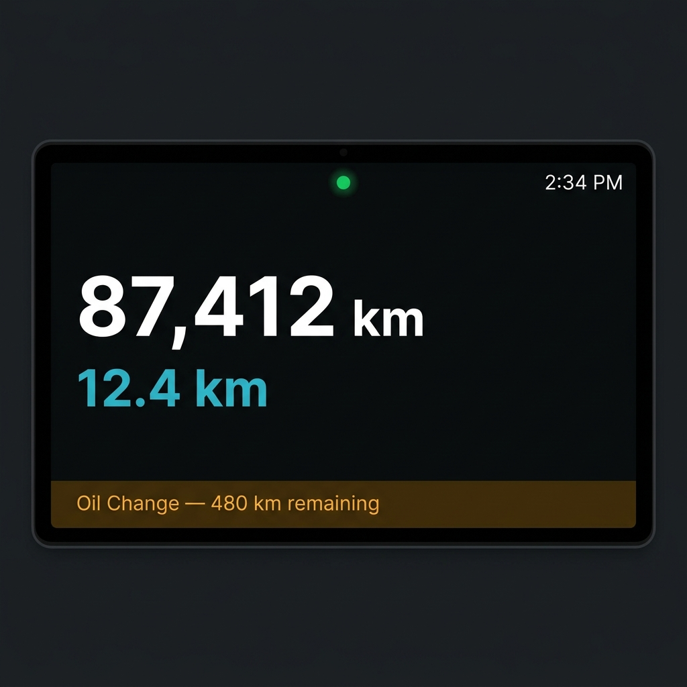
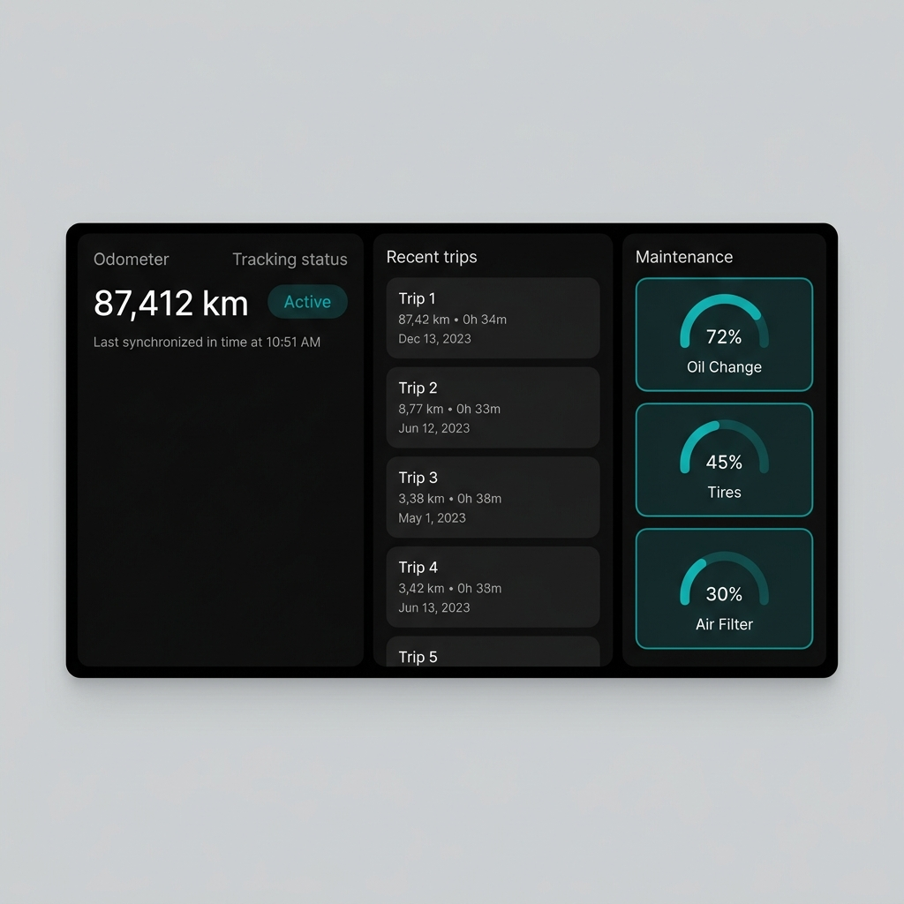
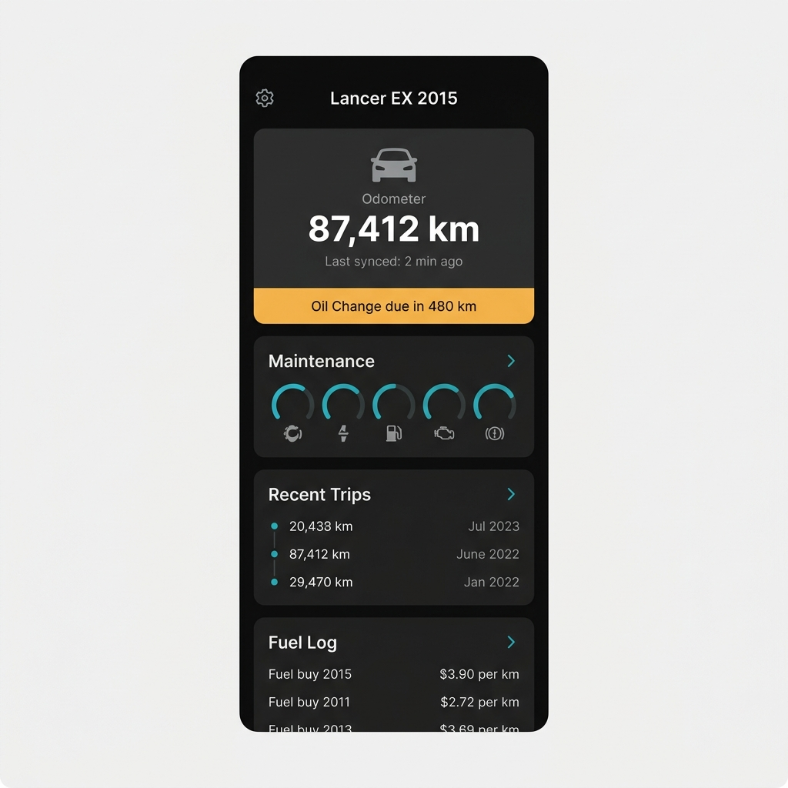
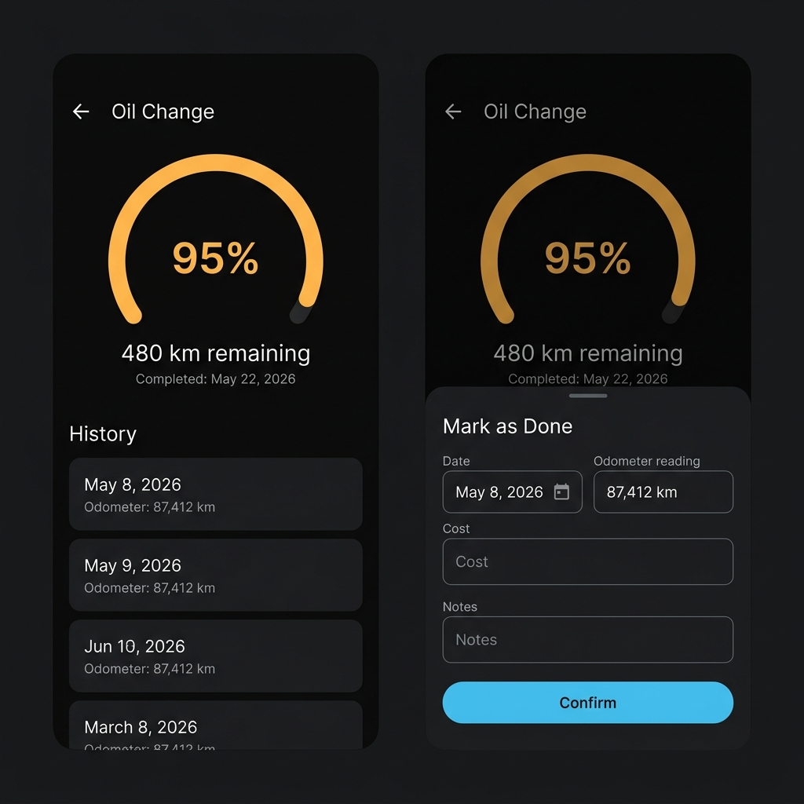
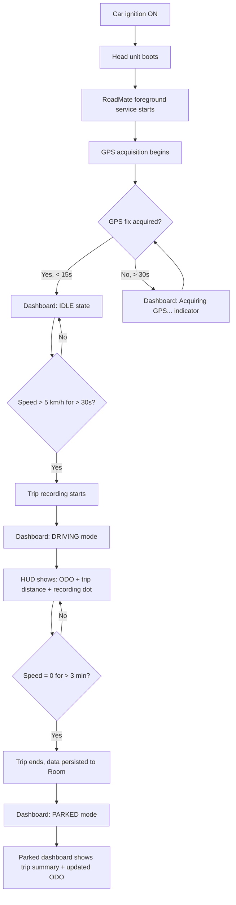
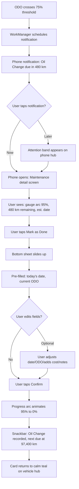
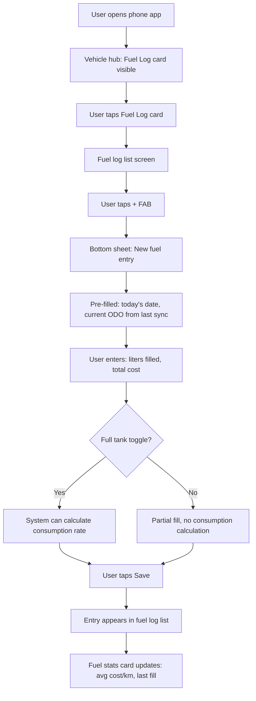
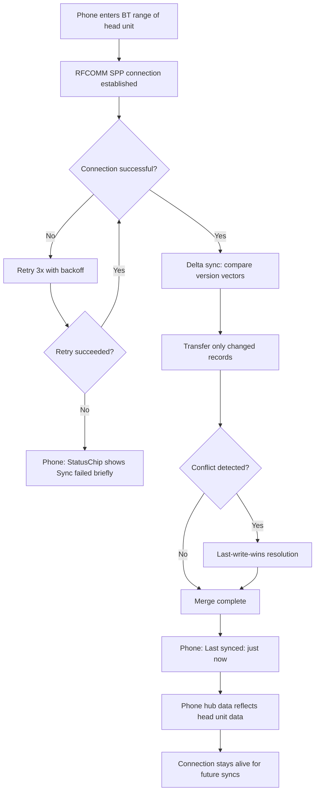
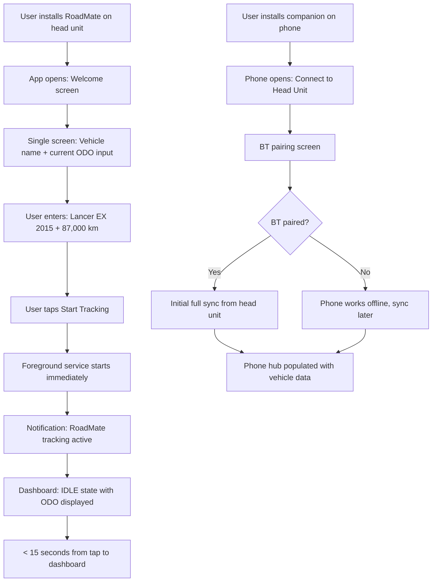

# UX Design Specification — RoadMate

**Author:** Ahmad
**Date:** 2026-05-08

---

## Executive Summary

### Project Vision

RoadMate transforms passive car ownership into data-informed vehicle management with zero behavioral change. The UX philosophy is **invisible automation, visible insight** — the system does everything silently (track, sync, predict) and only surfaces information when the driver looks for it or when something needs attention.

The design language follows a **modern automotive dashboard aesthetic** inspired by Tesla's UI — dark themes, high contrast, contextual awareness, and a vehicle-centric information hierarchy. Both apps feel like extensions of the car itself, not utility software bolted on top.

### Target Users

**Primary User: Ahmad (V1 daily driver)**
- Drives a Mitsubishi Lancer EX 2015 in Cairo with an aftermarket Android head unit
- Pixel phone already Bluetooth-paired for calls and music
- Tech-savvy developer, but the app must work as if he's not — zero daily interaction required
- Interacts with head unit in two modes: quick glances at red lights and deeper exploration when parked
- Does vehicle management tasks (mark maintenance done, log fuel) on the phone at home

**Secondary User: Multi-vehicle household**
- Same phone manages multiple vehicles with independent tracking
- Vehicle switcher enables seamless profile changes on both devices

### Key Design Challenges

1. **Dual-context head unit interaction** — The same screen must serve a 2-second glance at 60 km/h AND a 2-minute exploration session while parked. The UI must adapt based on driving state without requiring user mode-switching.

2. **Arm's-length automotive readability** — Head unit is 7-10" landscape, viewed from ~60cm. Text size, touch targets, and contrast must be calibrated for this distance and form factor. No fine interaction while moving.

3. **Cross-device coherence without redundancy** — Head unit and phone show related data but serve different purposes. The phone is the management hub; the head unit is the awareness layer. They must feel like one system, not two separate apps with duplicated screens.

4. **Power-loss graceful degradation** — The head unit can lose power mid-operation. UI state must never corrupt, and recovery on reboot must be seamless with no user intervention needed.

5. **Zero-chrome phone navigation** — With no tab bar, discoverability of deeper features (full trip list, maintenance schedule editor, fuel history) relies entirely on card design and visual hierarchy. Cards must clearly communicate "tap me for more."

### Design Opportunities

1. **Context-aware morphing dashboard (head unit)** — Using the existing trip detection state machine (IDLE → DRIVING → STOPPING), the UI transforms between a minimal driving HUD and a full parked dashboard. This creates a "living interface" that feels intelligent and automotive-native.

2. **Vehicle-centric phone hub** — The Tesla-style single-scroll layout with the vehicle as the hero creates an emotional connection — you open the app and *see your car*, not a feature menu. The attention band makes the app feel proactive ("here's what needs your attention") rather than reactive.

3. **Progress-bar-driven maintenance UX** — Transforming maintenance from a checklist into visual progress bars with estimated dates turns abstract schedules into intuitive "fuel gauge" metaphors. The driver reads maintenance status the same way they read a fuel gauge — at a glance.

4. **Invisible sync as trust signal** — Bluetooth sync happens silently, but a subtle sync status indicator (last synced timestamp, animated pulse on sync) builds confidence that data is flowing without demanding attention.

## Core User Experience

### Defining Experience

**Core Philosophy: "The best interaction is no interaction."**

RoadMate's defining experience is *passive value delivery*. The most frequent user "interaction" is a glance — consuming information that was collected, processed, and surfaced without any user input. The app earns trust by being silently competent: trips appear in the history without logging, maintenance predictions update without calculation, and data flows to the phone without configuration.

The only moments requiring active input are:
1. **First-time setup** — Vehicle profile, odometer entry, template selection (~2-3 minutes, once)
2. **Maintenance mark-as-done** — Closes the predict → alert → service → reset loop (phone, at home)
3. **Fuel log entry** — Manual by nature, since there's no fuel sensor in V1 (phone, at station or at home)
4. **Odometer reconciliation** — Periodic manual correction if GPS drift accumulates (rare)

Everything else is automated or consumed passively.

### Platform Strategy

| Platform | Form Factor | Context | Role |
|---|---|---|---|
| **Head Unit** | 7-10" landscape, Android | In-car, driving or parked | Awareness layer — glanceable status, context-aware dashboard |
| **Phone** | 5-7" portrait, Android (Pixel) | At home, relaxed | Management hub — full CRUD, notifications, detailed history |

**Key platform decisions:**
- **Head unit is read-heavy, phone is write-heavy.** The head unit shows; the phone manages.
- **Touch targets on head unit:** Minimum 48dp on phone, minimum **64dp on head unit** (arm's-length, vibration from driving)
- **No keyboard input on head unit.** Number entry only (odometer). All text-heavy input (notes, station names) happens on phone.
- **Offline-only architecture.** Both apps work without any network. No loading spinners for API calls — data is always local.
- **Material 3 + automotive dark theme.** Jetpack Compose with a custom dark color scheme: deep blacks, accent colors for alerts (amber, red), cool blues/teals for status, high-contrast white text.

### Effortless Interactions

| Interaction | Effort Level | How |
|---|---|---|
| Trip recording | Zero — fully automatic | GPS state machine detects movement, records, ends on timeout |
| Data sync | Zero — fully automatic | Bluetooth RFCOMM triggers on connection, event-driven + periodic |
| Dashboard status check | Passive — glance only | Context-aware layout surfaces relevant info based on driving state |
| Maintenance awareness | Passive — notification | Phone notification at 500 km threshold, head unit progress bar always visible |
| Document expiry awareness | Passive — notification | Phone notification 30 days before expiry |
| Vehicle switching | One tap | Vehicle switcher in header (head unit) or hero section (phone) |
| Maintenance mark-as-done | 3-4 taps | Card → mark done → confirm odometer/date → save |
| Fuel log entry | 5-6 taps + number input | Card → add → liters/price/odometer → save |

### Critical Success Moments

1. **First boot after install (head unit)** — The foreground service starts, the notification reads "RoadMate tracking active," and within 15 seconds the dashboard shows the vehicle with its odometer. The user thinks: *"It's already working."*

2. **First automatic trip appears** — After the first drive, the trip shows up in the history with distance, time, and speed — without the user doing anything. This is the moment the app proves its value proposition.

3. **First maintenance notification** — The phone buzzes: "Oil Change due in 480 km — estimated May 22." The driver realizes the app is *predicting* for them. This converts a tracking tool into a proactive assistant.

4. **First sync witnessed** — The user opens the phone app and sees today's trip already there. They didn't transfer anything. The Bluetooth link they already had for music just carried data. *"Wait, it syncs automatically?"*

5. **Maintenance mark-as-done satisfaction** — After servicing, the user taps mark done, enters the cost, and watches the progress bar reset to 0%. The cycle closes cleanly. They feel in control.

### Experience Principles

| # | Principle | Implication |
|---|---|---|
| 1 | **Invisible until useful** | No onboarding tours, no tip popups, no feature walkthroughs. The app runs silently and surfaces information only when consumed or when action is needed. |
| 2 | **Glanceable over interactive** | Information density wins over interaction richness on the head unit. If the driver needs to *do* something, it should wait for the phone. |
| 3 | **Vehicle-first, not feature-first** | Both apps are organized around the vehicle, not around features. You see your car's status — not a "trips tab" or a "maintenance module." |
| 4 | **Earned trust through accuracy** | The app must be right. False trip notifications, wrong maintenance predictions, or missed sync events destroy trust faster than a bad UI does. Correctness > aesthetics. |
| 5 | **Automotive, not app-like** | Dark theme, gauge-inspired progress indicators, contextual UI morphing. The interface should feel like it belongs in a car, not on a phone. |

## Desired Emotional Response

### Primary Emotional Goals

1. **Quiet confidence** — "My car is taken care of." Not excitement, not delight — *confidence*. The driver doesn't worry about when the oil change is due because the app has it. The emotional anchor is relief from cognitive load.

2. **Informed control** — "I know exactly what's going on with my car." Opening the phone app and seeing odometer, next maintenance, fuel costs, trip history — a complete picture. The feeling of ownership mastery.

3. **Technical satisfaction** — "This thing just works." The auto-sync, the crash recovery, the drift rejection — when these work invisibly, the emotional response is satisfaction with the system's competence.

### Emotional Journey Mapping

| Moment | Desired Emotion | Design Lever |
|---|---|---|
| First boot | Reassurance — "It's already working" | Immediate tracking notification, dashboard populated in <15s |
| Glancing at dashboard while driving | Calm awareness — quick read, no stress | Minimal driving mode, large text, no interaction needed |
| Receiving maintenance notification | Empowered — "I'm ahead of this" | Specific info (item, km remaining, estimated date), not just "check your car" |
| Opening phone app at home | Informed satisfaction — "I can see everything" | Vehicle hero, all data fresh from sync, attention band for action items |
| Marking maintenance done | Closure — the loop is complete | Progress bar resets to 0%, satisfying visual feedback |
| After a power loss recovery | Relief → trust — "Nothing was lost" | Interrupted trip shows with recovered data, no corruption |
| Discovering a feature organically | Pleasant surprise — not overwhelm | Features surface through cards when relevant, not through onboarding tours |

### Micro-Emotions

**Emotions to cultivate:**
- **Confidence over confusion** — Status indicators always visible; system state is never ambiguous
- **Trust over skepticism** — No phantom data; if the app shows a number, it's accurate
- **Satisfaction over frustration** — Smooth animations, clean transitions, responsive touch
- **Calm over anxiety** — Muted palette with accent-only alerts; no alarm-style UX patterns

**Emotions to prevent:**
- **Anxiety** — "Did it record that trip?" → Countered by visible status indicators
- **Guilt** — "I forgot to log that fuel stop" → Countered by forgiving data entry (log it later, it still works)
- **Overwhelm** — "There's too much data here" → Countered by progressive disclosure (cards → detail screens)
- **Distrust** — "Is this odometer number right?" → Countered by showing GPS vs manual ODO side-by-side

### Design Implications

| Emotion | UX Design Approach |
|---|---|
| **Confidence** | Persistent status indicators (tracking active, last sync time), progress bars that always show current state |
| **Calm** | Driving mode strips UI to essentials, muted color palette with accent-only highlights for alerts |
| **Control** | All data editable (odometer, maintenance dates), manual sync button available even if auto-sync handles it |
| **Satisfaction** | Smooth animations on state transitions (progress bar fill, trip recording indicator), clean data presentation |
| **Trust** | No phantom data — if the app shows a number, it's accurate. GPS vs manual ODO displayed honestly |

### Emotional Design Principles

| # | Principle | Application |
|---|---|---|
| 1 | **Calm over exciting** | The app should feel like a well-tuned instrument, not a gamified experience. No celebrations, no badges, no streaks. |
| 2 | **Honest over flattering** | Show real data, including gaps and uncertainties. An interrupted trip is labeled as such, not hidden. |
| 3 | **Forgiving over rigid** | Forgot to log fuel yesterday? Log it today with yesterday's date. Odometer off by 50 km? Correct it anytime. |
| 4 | **Ambient over demanding** | Notifications are informational, not urgent. Progress bars are always visible, not gated behind interactions. |

## UX Pattern Analysis & Inspiration

### Inspiring Products Analysis

**Tesla Mobile App**
- **Core strength:** Vehicle-as-hero design. The car silhouette dominates the screen, creating an immediate emotional connection. Everything else is secondary.
- **Navigation:** No tab bar. Single scrollable view with expandable cards. Settings via profile icon. Feels like one cohesive screen, not a multi-page app.
- **Visual:** Pure dark theme, minimal color — white text on near-black, with blue accents for interactive elements. No gradients, no shadows, no visual noise.
- **Lesson:** A vehicle management app can be beautiful and simple simultaneously. Less UI chrome = more focus on the vehicle.

**Tesla In-Car UI**
- **Core strength:** Context-aware layout that transforms based on driving state. The screen shows what's relevant *now* — navigation while driving, media controls when stopped, full settings when parked.
- **Readability:** Large sans-serif typography, high contrast ratios (>7:1), generous whitespace between interactive elements.
- **Data visualization:** Real-time gauges and graphs use clean arcs and lines — no skeuomorphic needles, no fake leather textures.
- **Lesson:** The UI should feel like an instrument panel — precise, clean, functional. Context-awareness makes density manageable.

**Apple CarPlay / Android Auto**
- **Core strength:** Designed under the assumption that the driver has <2 seconds to glance. Every design decision serves glanceability.
- **Touch targets:** Minimum 76x76dp for primary actions. No small buttons, no close-together tap zones.
- **Information density:** Maximum 3-4 pieces of information visible at once in driving mode. Details are deferred to when the vehicle is stationary.
- **Lesson:** The head unit driving mode should follow these constraints religiously. When the car is moving, the UI is a HUD, not a dashboard.

**Fuelio / Drivvo (Competitive Anti-Reference)**
- **Core weakness:** Feature-organized, not vehicle-organized. Tab bar with "Vehicles | Fill-ups | Costs | Routes" forces the user to think in features, not in "my car."
- **Visual:** Generic Material Design, light theme default, dense list views. Functional but not inspiring.
- **Data entry:** Multiple required fields per entry, strict validation, linear forms. Feels like data entry, not vehicle care.
- **Lesson:** These apps prove the market exists but show exactly what *not* to do aesthetically and structurally.

### Transferable UX Patterns

**Navigation Patterns:**

| Pattern | Source | Application in RoadMate |
|---|---|---|
| Vehicle-as-hero single scroll | Tesla Mobile | Phone app: vehicle silhouette/name as hero, feature cards below |
| Context-aware layout morphing | Tesla In-Car | Head unit: DRIVING mode → HUD, PARKED mode → full dashboard |
| Card-based progressive disclosure | Tesla Mobile | Both apps: summary cards that expand/navigate to detail screens |
| Top-bar-only navigation chrome | Tesla Mobile | Phone app: gear icon (settings), vehicle switcher — no bottom bar |

**Interaction Patterns:**

| Pattern | Source | Application in RoadMate |
|---|---|---|
| Glanceable status indicators | CarPlay/Auto | Head unit driving mode: ODO + trip distance + next alert, nothing more |
| Large touch targets (76dp+) | CarPlay/Auto | Head unit: all interactive elements minimum 64dp, primary actions 76dp |
| Pull-to-refresh for sync | Common mobile | Phone app: pull down on vehicle hub to trigger manual BT sync |
| Swipe-to-dismiss for alerts | Tesla Mobile | Phone app: attention band alerts dismissible by swipe |

**Visual Patterns:**

| Pattern | Source | Application in RoadMate |
|---|---|---|
| Pure dark theme (OLED-friendly) | Tesla | Both apps: near-black backgrounds (#0A0A0A), not dark gray |
| Accent-only color | Tesla | Teal/blue for status, amber for warnings, red for critical — no decorative color |
| Arc/gauge progress indicators | Tesla In-Car | Maintenance progress as circular arcs, not rectangular progress bars |
| Clean sans-serif typography | Tesla | Inter or Roboto at large sizes, high contrast ratios |

### Anti-Patterns to Avoid

| Anti-Pattern | Why It Fails | RoadMate Alternative |
|---|---|---|
| Tab bar navigation | Feature-centric thinking, splits the vehicle experience | Single scroll vehicle hub with card-based access |
| Light theme default | Doesn't feel automotive, causes glare in car at night | Dark-only theme, no light mode option |
| Dense list views for primary data | Requires reading, not glancing — fails the 2-second test | Card-based summaries with drill-down for detail |
| Required fields on every form | Creates guilt and friction for manual entries | Smart defaults, optional fields, log-it-later flexibility |
| Onboarding tours/tooltips | Violates "invisible until useful" principle | Features discovered through cards when data becomes available |
| Achievement/gamification patterns | Conflicts with "calm over exciting" emotional principle | Clean data, honest numbers, no badges or streaks |

### Design Inspiration Strategy

**Adopt directly:**
- Tesla's vehicle-as-hero layout for the phone app
- Tesla In-Car's context-aware morphing for the head unit
- CarPlay's glanceability constraints for driving mode
- Dark-only theme with accent-only color

**Adapt for RoadMate:**
- Tesla's car silhouette → simplified vehicle icon/illustration (not a photorealistic car render)
- Tesla's energy gauges → maintenance progress arcs and trip distance counters
- CarPlay's 76dp targets → 64dp minimum (head unit is closer than CarPlay screens in some setups)

**Deliberately reject:**
- Fuelio/Drivvo's tab-based, feature-first navigation
- Any light theme or theme toggle
- Onboarding flows, feature tours, or tip banners
- Gamification, streaks, or social features

## Design System Foundation

### Design System Choice

**Material 3 (Material You) as foundation + custom automotive components**

Jetpack Compose with `MaterialTheme` provides the scaffolding, accessibility, and proven component patterns. Custom Compose components are built on top for the automotive-specific UX elements that differentiate RoadMate from a generic app.

### Rationale for Selection

| Factor | Assessment |
|---|---|
| **Platform** | Native Android / Jetpack Compose — M3 is the native design system |
| **Team size** | Solo developer — can't maintain a fully custom system |
| **Brand requirement** | Automotive dark theme, not stock M3 — requires customization, not replacement |
| **Timeline** | Personal project, but shipping matters — M3 accelerates standard screens |
| **Uniqueness need** | Dashboard and driving HUD must feel custom; settings and forms don't |
| **Accessibility** | M3 provides contrast ratios, touch target sizing, and semantics for free |

### Implementation Approach

**Layer 1: M3 Theme Customization**
- Custom `ColorScheme` (dark-only): near-black surfaces, teal/blue accents, amber/red alerts
- Custom `Typography`: Inter or Roboto at automotive-scaled sizes (larger than M3 defaults for head unit)
- Custom `Shapes`: More angular than M3 defaults — squared-off cards, minimal rounding (4dp radius vs M3's 12dp)
- No dynamic color / Material You wallpaper-based theming — colors are fixed and intentional

**Layer 2: Standard M3 Components (Used As-Is with Theme)**
- `Card` — for feature cards on phone hub and head unit parked mode
- `TopAppBar` — for phone detail screens
- `TextField` / `OutlinedTextField` — for data entry (fuel logs, maintenance notes)
- `AlertDialog` — for confirmations (mark maintenance done, delete trip)
- `Scaffold` — for screen structure
- `NavigationDrawer` — for settings/vehicle switching on phone (if needed)
- `Snackbar` — for non-blocking feedback (sync complete, data saved)

**Layer 3: Custom Automotive Components (Built in Compose)**

| Component | Purpose | Used On |
|---|---|---|
| `GaugeArc` | Circular progress arc for maintenance items (0-100%) | Both apps |
| `DrivingHUD` | Minimal driving mode overlay (ODO, trip distance, speed, time) | Head unit |
| `ParkedDashboard` | Full card-grid layout for parked state | Head unit |
| `VehicleHeroCard` | Vehicle silhouette + ODO + sync status as hero | Phone |
| `AttentionBand` | Amber/red alert strip for items needing action | Phone |
| `TripLiveIndicator` | Pulsing recording indicator with live distance counter | Head unit |
| `ContextAwareLayout` | Layout container that switches children based on driving state | Head unit |
| `ProgressRing` | Compact circular progress for inline maintenance status | Both apps |
| `StatusChip` | Tracking active / synced / last sync time indicator | Both apps |

### Customization Strategy

**Color Tokens:**

| Token | Value | Usage |
|---|---|---|
| `surface` | `#0A0A0A` | Primary background (near-black) |
| `surfaceVariant` | `#1A1A1A` | Card backgrounds, elevated surfaces |
| `onSurface` | `#E8E8E8` | Primary text (slightly off-white for reduced glare) |
| `onSurfaceVariant` | `#9E9E9E` | Secondary text, labels |
| `primary` | `#4FC3F7` | Teal/blue — status indicators, interactive elements |
| `secondary` | `#80CBC4` | Teal — secondary status, progress arcs |
| `tertiary` | `#FFB74D` | Amber — warnings, approaching thresholds |
| `error` | `#EF5350` | Red — critical alerts, overdue items |
| `surfaceContainer` | `#121212` | Bottom sheets, dialogs |

**Typography Scale (Head Unit — larger):**

| Style | Size | Weight | Usage |
|---|---|---|---|
| `displayLarge` | 48sp | Bold | ODO number on dashboard |
| `headlineMedium` | 28sp | SemiBold | Card titles, section headers |
| `titleLarge` | 22sp | Medium | Trip distance, speed readouts |
| `bodyLarge` | 18sp | Regular | Primary body text |
| `labelLarge` | 16sp | Medium | Button text, chip labels |

**Typography Scale (Phone — standard M3 with minor adjustments):**

| Style | Size | Weight | Usage |
|---|---|---|---|
| `displayLarge` | 36sp | Bold | Vehicle ODO on hero card |
| `headlineMedium` | 24sp | SemiBold | Screen titles, card headers |
| `titleMedium` | 16sp | Medium | List item titles |
| `bodyLarge` | 16sp | Regular | Body text |
| `bodyMedium` | 14sp | Regular | Secondary text |
| `labelSmall` | 11sp | Medium | Timestamps, metadata |

**Spacing & Touch Targets:**

| Platform | Min Touch Target | Card Padding | Section Gap |
|---|---|---|---|
| Head unit | 64dp | 20dp | 16dp |
| Phone | 48dp | 16dp | 12dp |

## Defining Core Experience

### The Defining Experience

If a friend asks "What does RoadMate do?", the answer is:

> **"It keeps track of my car for me — I don't do anything."**

The defining experience is the **absence of effort** that produces **visible results**. The "wow moment" is opening the phone app and seeing that the car has been silently monitored — trips recorded, maintenance predicted, data synced — without lifting a finger.

### User Mental Model

**How drivers currently handle vehicle management:**
- **Maintenance:** Sticker on the windshield from the mechanic, or just forget until something breaks
- **Trip tracking:** They don't. Maybe check Google Maps timeline occasionally
- **Fuel costs:** Vague sense of "I'm spending too much on fuel" with no data
- **Document expiry:** Surprise fine when stopped by police

**Mental model they bring:** "Car apps are annoying — they make me log things manually, they nag me, they require setup." The expectation is friction.

**RoadMate's job:** Break that expectation. The mental model shifts from "I have to manage my car" to "My car manages itself."

### Success Criteria

| Criteria | Measurement |
|---|---|
| Zero-touch daily value | Trips appear in history without any user action |
| Predictive awareness | Maintenance notification arrives *before* the service is overdue |
| Sync invisibility | Phone data is fresh from last BT connection without manual trigger |
| Glanceable status | Dashboard communicates vehicle state in <2 seconds |
| Mark-as-done satisfaction | Closing a maintenance cycle feels clean and complete (progress reset animation) |
| First-session trust | Within 24 hours of install, at least one trip is auto-recorded and synced |

### Novel UX Patterns

RoadMate uses a **novel combination of established patterns** — no new interaction paradigms to teach:

| Pattern | Type | Innovation |
|---|---|---|
| Background service tracking | Established (fitness apps) | Applied to vehicle context with GPS state machine |
| Dashboard with cards | Established (Tesla, home automation) | Context-aware morphing between driving/parked states |
| Progress bars for status | Established (download managers, fitness) | Applied to maintenance cycles as "fuel gauge" metaphor |
| Bluetooth sync | Established (wearables) | Repurposing existing audio BT link as data channel |
| Local notifications | Established (calendar, reminders) | Predictive maintenance alerts based on driving patterns |

### Experience Mechanics

**The Core Loop (Automated):**

```
Boot → Track → Accumulate → Predict → Sync → Notify → Act → Reset
```

| Stage | What Happens | User Involvement | UX Feedback |
|---|---|---|---|
| **Boot** | Head unit powers on, service starts | None | Notification: "RoadMate tracking active" |
| **Track** | GPS state machine detects trip, records route | None | Head unit: trip live indicator (pulsing dot + distance counter) |
| **Accumulate** | ODO increases, maintenance progress advances | None | Dashboard: progress bars inch forward, ODO updates |
| **Predict** | System calculates estimated service dates | None | Dashboard: "Oil Change — est. May 22" |
| **Sync** | BT connects, delta sync transfers data | None | Phone: subtle sync pulse, "Last synced: just now" |
| **Notify** | WorkManager checks thresholds, fires alert | Passive (reads notification) | Phone notification: "Oil Change due in 480 km" |
| **Act** | User marks maintenance done | Active (3-4 taps) | Progress bar resets to 0%, snackbar confirms |
| **Reset** | Cycle begins again | None | Next maintenance item becomes the active prediction |

**The Active Interaction — "Mark as Done" Flow:**

1. **Initiation:** User opens phone app, sees maintenance card showing "Oil Change — 95% — 480 km remaining" with amber highlight
2. **Action:** Taps card → maintenance detail → "Mark as Done" button
3. **Confirmation:** Bottom sheet slides up with pre-filled fields: today's date, current ODO (from last sync), empty cost field, empty notes field. Only ODO and date are required.
4. **Feedback:** Progress arc animates from 95% back to 0%. Snackbar: "Oil Change recorded — next due at 97,400 km." The card color returns to calm teal.
5. **Completion:** User sees the next maintenance item promoted to the dashboard card. The loop is visually complete.

## Visual Design Foundation

### Color System

**Philosophy:** Automotive instrument cluster — dark canvas, information conveyed through color meaning, not decoration. Every color earns its place by communicating something.

**Surface Hierarchy (Dark Theme Layers):**

| Layer | Token | Hex | Usage |
|---|---|---|---|
| L0 — Canvas | `surface` | `#0A0A0A` | App background, true black for OLED |
| L1 — Elevated | `surfaceVariant` | `#1A1A1A` | Cards, containers, elevated content |
| L2 — Modal | `surfaceContainer` | `#121212` | Bottom sheets, dialogs, overlays |
| L3 — Input | `surfaceBright` | `#242424` | Text field backgrounds, selected states |

**Semantic Color Palette:**

| Role | Token | Hex | Usage Rules |
|---|---|---|---|
| **Status** | `primary` | `#4FC3F7` | Default state indicators, interactive elements, links. The "everything is fine" color. |
| **Progress** | `secondary` | `#80CBC4` | Gauge arcs, progress fills, secondary status. Slightly muted vs primary. |
| **Warning** | `tertiary` | `#FFB74D` | Approaching thresholds (maintenance 75-95%), attention band on phone. Not alarming. |
| **Critical** | `error` | `#EF5350` | Overdue items, expired documents, failed sync. Demands action. |
| **Success** | `success` | `#66BB6A` | Completed actions, synced confirmation, mark-as-done feedback. Used sparingly. |
| **Neutral text** | `onSurface` | `#E8E8E8` | Primary text. Slightly off-white to reduce glare on OLED in dark car. |
| **Secondary text** | `onSurfaceVariant` | `#9E9E9E` | Labels, metadata, timestamps. Readable but not dominant. |
| **Disabled** | `outline` | `#4A4A4A` | Inactive elements, dividers, borders |

**Color Usage Rules:**
- Maximum 2 accent colors visible at any time on a single screen
- Warning amber only appears when a threshold is approaching (not decorative)
- Critical red only appears when something is overdue or failed (never decorative)
- Success green appears momentarily (snackbar, animation) then fades — not persistent
- No gradients, no color backgrounds on cards — cards are `surfaceVariant` with colored *indicators* (progress arcs, status dots)

### Typography System

**Font Choice: Inter**
- **Why Inter:** Designed for screen readability at all sizes. Excellent tabular (monospaced) number support — critical for ODO counters, speed readouts, and distance values. Open source, variable font weight support.
- **Alternative:** Roboto (system default on Android) as fallback if Inter adds APK size concerns.
- **No secondary font.** Single typeface, weight variations only. Automotive dashboards use one font family.

**Numeric Display:**
- All numeric values (ODO, distance, speed, cost) use **Inter tabular figures** (`font-feature-settings: "tnum"`) so digits don't jump when values change (87,400 → 87,401 stays aligned)
- Large counters (ODO on dashboard) use `displayLarge` weight Bold for maximum impact

**Type Hierarchy Summary:**

| Level | Head Unit | Phone | Purpose |
|---|---|---|---|
| Display | 48sp Bold | 36sp Bold | Primary metric (ODO number) |
| Headline | 28sp SemiBold | 24sp SemiBold | Card titles, screen headers |
| Title | 22sp Medium | 16sp Medium | Secondary metrics (trip distance, speed) |
| Body | 18sp Regular | 16sp Regular | Descriptions, content |
| Label | 16sp Medium | 14sp Medium | Button text, chip labels |
| Caption | 14sp Regular | 11sp Medium | Timestamps, metadata |

### Spacing & Layout Foundation

**Base Unit: 4dp**

| Token | Value | Usage |
|---|---|---|
| `space-xs` | 4dp | Inner padding for tight elements (chip content) |
| `space-sm` | 8dp | Gap between inline elements, icon-to-text spacing |
| `space-md` | 12dp | Card internal section gaps (phone) |
| `space-lg` | 16dp | Card internal padding (phone), section gaps (head unit) |
| `space-xl` | 20dp | Card internal padding (head unit) |
| `space-2xl` | 24dp | Between cards in scrollable lists |
| `space-3xl` | 32dp | Major section separators |

**Layout Grid:**

| Platform | Grid | Margins | Gutters |
|---|---|---|---|
| Head unit (landscape) | 12-column | 24dp | 16dp |
| Phone (portrait) | 4-column | 16dp | 8dp |

**Head Unit Layout Zones (Landscape):**
- **Driving mode:** Single zone — full screen is the HUD, no columns
- **Parked mode:** 3 zones — left panel (4 cols: vehicle status), center panel (4 cols: trips/activity), right panel (4 cols: maintenance/fuel)

**Elevation & Depth:**
- No drop shadows (flat dark surfaces don't benefit from shadow)
- Depth communicated through **surface color stepping** (L0 → L1 → L2)
- Active/selected states use subtle border (`1dp outline` in `primary` color) instead of elevation

### Iconography

**Style:** Outlined icons, 24dp standard size (phone), 32dp (head unit)
**Source:** Material Symbols Outlined — consistent with M3, customizable weight/grade
**Custom icons needed:**
- Vehicle silhouette (simplified car outline for hero card)
- Gauge arc icon (for maintenance)
- BT sync icon (Bluetooth + sync arrows)
- Trip route icon (simplified path/road)

**Icon color rules:**
- Default: `onSurfaceVariant` (#9E9E9E)
- Active/interactive: `primary` (#4FC3F7)
- Warning state: `tertiary` (#FFB74D)
- Error state: `error` (#EF5350)

### Motion & Animation

**Principles:**
- **Purposeful, not decorative.** Animations communicate state changes, not personality.
- **Fast and responsive.** 200-300ms for transitions, 150ms for micro-interactions.
- **Ease-out curves.** Elements arrive quickly and settle naturally (`FastOutSlowIn`).

**Key animations:**

| Animation | Duration | Curve | Trigger |
|---|---|---|---|
| Dashboard mode transition (driving ↔ parked) | 400ms | `FastOutSlowIn` | Driving state change |
| Progress arc fill/reset | 600ms | `LinearOutSlowIn` | Maintenance update |
| Trip live indicator pulse | 1500ms | `LinearEasing` (loop) | Active trip recording |
| Card expand/collapse | 250ms | `FastOutSlowIn` | User tap |
| Sync status pulse | 800ms | `EaseInOut` (2x) | Sync in progress |
| Snackbar enter/exit | 200ms | `FastOutSlowIn` | System feedback |

### Accessibility Considerations

| Requirement | Implementation |
|---|---|
| **Contrast ratios** | All text meets WCAG AA minimum: `onSurface` (#E8E8E8) on `surface` (#0A0A0A) = 17.4:1; `onSurfaceVariant` (#9E9E9E) on `surface` = 8.5:1 |
| **Touch targets** | 64dp minimum (head unit), 48dp minimum (phone) — exceeds M3's 48dp recommendation |
| **Font scaling** | Support Android system font size preferences (sp units throughout) |
| **Color-only indicators** | Never use color alone — progress arcs include percentage text, alerts include icon + text label |
| **Screen reader** | Compose semantics on all interactive elements, contentDescription on custom components |
| **Reduced motion** | Respect `AccessibilityManager.isReduceMotionEnabled` — skip animations, show end state directly |

## Design Direction Decision

### Design Direction: Unified Automotive Dashboard

A single, cohesive design direction emerged from the cumulative decisions in steps 3-8. Rather than exploring competing visual directions, all prior decisions converged on one clear approach: **dark automotive, vehicle-centric, gauge-driven, card-based.**

### Key Screen Designs

**1. Head Unit — Driving Mode (HUD)**



Pure HUD layout: ODO number dominant center-left, trip distance in teal below, recording indicator dot, time top-right, single amber maintenance alert strip at bottom. Zero interactive elements — glance-only.

**2. Head Unit — Parked Mode (Dashboard)**



Three-panel landscape layout: vehicle status (left), recent trips (center), maintenance gauges (right). All information at a glance without scrolling. Cards on dark elevated surfaces, teal gauge arcs for maintenance progress.

**3. Phone — Vehicle Hub (Home Screen)**



Tesla-style single scroll: vehicle hero card (car silhouette + ODO + sync status) at top, amber attention band for alerts, then card stack for maintenance (mini gauge arcs), recent trips, and fuel log. No tab bar.

**4. Phone — Maintenance Detail (Mark as Done Flow)**



Large amber gauge arc at 95%, remaining km and estimated date below, maintenance history cards. Bottom sheet slides up for "Mark as Done" with pre-filled date and ODO, optional cost and notes fields, teal confirm button.

### Design Rationale

| Decision | Rationale |
|---|---|
| **Single direction, no alternatives** | Steps 3-8 progressively narrowed the design space. Tesla-style dark automotive was established as the only direction that satisfies all emotional goals, platform constraints, and brand positioning. |
| **Context-aware dual-mode head unit** | Driving safety requires HUD minimalism; parked state allows full dashboard. The transition is the defining UX moment for the head unit. |
| **Vehicle-as-hero phone layout** | Aligns with "vehicle-first, not feature-first" principle. The car is the centerpiece, features orbit around it. |
| **Gauge arcs over progress bars** | Automotive metaphor (fuel gauge, tachometer) reinforces the automotive identity. More compact than horizontal bars for card layouts. |
| **Bottom sheet for mark-as-done** | Keeps context (the gauge, the history) visible while overlaying the action form. Pre-filled fields reduce friction to 1-2 taps. |

### Implementation Approach

- All screens built in Jetpack Compose with shared `RoadMateTheme`
- Head unit uses `ContextAwareLayout` composable to switch between driving and parked modes
- Phone uses `LazyColumn` with `VehicleHeroCard`, `AttentionBand`, and feature cards as items
- Custom `GaugeArc` composable shared across both platforms via `:core:ui` module
- Bottom sheets use M3 `ModalBottomSheet` with custom dark styling

## User Journey Flows

### Journey 1: Daily Drive (Zero-Touch)

The most frequent journey — happens every time the car starts. Entire flow is passive.



**User involvement:** None.
**Failure path:** GPS timeout → service retries with exponential backoff. Power loss → WAL journal recovery on next boot.

### Journey 2: Maintenance Alert → Mark as Done

The primary active interaction on the phone app.



**Steps to value:** 3-4 taps (notification → detail → mark as done → confirm)
**Error recovery:** Bottom sheet can be dismissed without saving. "Undo" snackbar for 5 seconds after confirmation.

### Journey 3: Fuel Log Entry

Manual entry on the phone — should feel fast and forgiving.



**Steps to value:** 4 taps + 2 number inputs (open → fuel card → "+" → enter liters & cost → save)
**Forgiveness:** Date is editable (log yesterday's fuel today). ODO is pre-filled but overridable.

### Journey 4: Bluetooth Sync

Invisible data transfer when phone and head unit are in BT range.



**User involvement:** None. Entire flow is automatic.
**Failure recovery:** Sync failures are silent (no alarm). StatusChip shows last successful sync time. Manual sync via pull-to-refresh as fallback.

### Journey 5: First-Time Setup

One-time setup — must build trust immediately.



**Steps to value:** 3 fields (name, ODO, "Start Tracking") → tracking active in <15s
**Trust building:** No onboarding tour, no feature explanation, no account creation. Type 2 things, tap 1 button, it works.

### Journey Patterns

| Pattern | Usage | Implementation |
|---|---|---|
| **Pre-fill + override** | Fuel entry, mark-as-done, any form with predictable values | System fills best guess (today's date, last ODO), user can override |
| **Bottom sheet for actions** | All write operations on phone (mark done, log fuel, edit ODO) | M3 `ModalBottomSheet`, dark theme, confirm button at bottom |
| **Snackbar + undo** | Confirmations for destructive/significant actions | 5-second undo window, then permanent |
| **Status chip as heartbeat** | Tracking status, sync status | Always visible on dashboard/hub, real-time updates |
| **Notification → detail deep link** | Maintenance alerts, sync failures | Notification tap opens exact relevant screen |
| **Progressive entry points** | Card summary → detail screen → action sheet | 3-layer depth: glance → read → act |

### Flow Optimization Principles

| Principle | Application |
|---|---|
| **Minimize taps to value** | No journey exceeds 5 taps from trigger to completion |
| **Pre-fill everything predictable** | Date, ODO, vehicle — never make the user type what the system knows |
| **Undo over confirm dialogs** | Snackbar with undo is faster than "Are you sure?" dialogs |
| **Silent failure, visible status** | Sync failures don't alert — they update the status chip |
| **Zero-setup tracking** | Head unit tracks from first boot with just name + ODO |

## Component Strategy

### Design System Components (M3 — Used As-Is)

| Component | M3 Name | RoadMate Usage |
|---|---|---|
| Cards | `Card` / `ElevatedCard` | Feature cards on phone hub, trip list items, maintenance list items |
| Top App Bar | `TopAppBar` | Phone detail screens (back navigation + title) |
| Text Fields | `OutlinedTextField` | Fuel entry, maintenance notes, ODO correction, vehicle name |
| Dialogs | `AlertDialog` | Confirmations: delete trip, reset maintenance |
| Bottom Sheets | `ModalBottomSheet` | Mark-as-done form, fuel entry form, ODO edit |
| Snackbar | `Snackbar` | Action feedback: "Saved", "Synced", with undo action |
| FAB | `FloatingActionButton` | "+" button on fuel log list |
| Scaffold | `Scaffold` | Screen structure for all phone screens |
| Chips | `AssistChip` | StatusChip base (tracking active, sync status) |
| Dividers | `HorizontalDivider` | Section separators in detail screens |

### Custom Components

#### `GaugeArc`

**Purpose:** Circular progress arc showing maintenance item lifecycle (0-100%)
**Usage:** Maintenance cards (both apps), maintenance detail screen (phone)
**Anatomy:**
- Arc track (background): `outline` (#4A4A4A), 8dp stroke
- Arc fill (progress): color varies by state (teal 0-74%, amber 75-94%, red 95-100%)
- Center text: percentage in `headlineMedium`
- Label below arc: item name in `bodyLarge`

**States:**

| State | Arc Color | Center Text | Behavior |
|---|---|---|---|
| Normal (0-74%) | `secondary` (#80CBC4) | "45%" | Static |
| Warning (75-94%) | `tertiary` (#FFB74D) | "85%" | Static |
| Critical (95-100%) | `error` (#EF5350) | "98%" | Subtle pulse (1.5s loop) |
| Completed (reset) | `success` (#66BB6A) | "0%" | Animate arc from previous → 0% (600ms) |

**Variants:** `Large` (detail screen, 160dp diameter), `Compact` (card inline, 48dp diameter)
**Accessibility:** ContentDescription: "[Item name]: [percentage] complete, [km remaining] until due"

#### `DrivingHUD`

**Purpose:** Minimal heads-up display for driving mode — glance-only, zero interaction
**Usage:** Head unit DRIVING state (full screen)
**Anatomy:**
- ODO number: `displayLarge` (48sp Bold), left-center
- Trip distance: `titleLarge` (22sp), teal, below ODO
- Recording indicator: 12dp circle, pulsing green, top-center
- Time: `titleLarge`, top-right
- Alert strip: bottom edge, amber/red background, full width, single line text

**States:**

| State | Alert Strip | Recording Dot |
|---|---|---|
| Tracking, no alerts | Hidden | Green, pulsing |
| Tracking, maintenance warning | Amber strip with text | Green, pulsing |
| Tracking, maintenance critical | Red strip with text | Green, pulsing |
| GPS acquiring | Hidden | Gray, static |

**Accessibility:** Entire HUD is read as a single announcement: "Odometer [value], trip [value], tracking [active/inactive]"

#### `ParkedDashboard`

**Purpose:** Three-panel information display for parked state
**Usage:** Head unit PARKED state (full screen, landscape)
**Anatomy:**
- Left panel (4 cols): ODO number, StatusChip (tracking), StatusChip (sync), vehicle name
- Center panel (4 cols): "Recent Trips" header, scrollable list of trip cards (max 5 visible)
- Right panel (4 cols): "Maintenance" header, stack of 3 `GaugeArc` compact items

**States:** Single state — always fully populated. Empty states show "No trips yet" / "No maintenance items configured"

#### `VehicleHeroCard`

**Purpose:** Primary identity card for the phone hub — vehicle-first anchor
**Usage:** Phone hub, top of scroll (always visible until scrolled past)
**Anatomy:**
- Vehicle icon: simplified car silhouette, 64dp, centered, `onSurfaceVariant`
- Vehicle name: `headlineMedium` below icon
- ODO number: `displayLarge` (36sp Bold) below name
- Sync status: `labelSmall` in `onSurfaceVariant` — "Last synced: 2 min ago"
- Background: `surfaceVariant` (#1A1A1A), 4dp corner radius

**States:**

| State | Sync Label | Visual |
|---|---|---|
| Synced recently (<5 min) | "Last synced: just now" | Default |
| Stale (>1 hour) | "Last synced: 3 hours ago" | Label in `onSurfaceVariant` |
| Never synced | "Not yet synced" | Label in `tertiary` |

#### `AttentionBand`

**Purpose:** Prominent alert strip for items needing action
**Usage:** Phone hub, between hero card and feature cards
**Anatomy:**
- Full-width strip, 48dp height
- Background: `tertiary` (#FFB74D) for warnings, `error` (#EF5350) for critical
- Text: Dark text on amber/red, single line, `labelLarge`
- Tap target: entire strip is tappable, deep-links to relevant detail screen
- Swipe: swipe-to-dismiss (defers, doesn't resolve)

**States:** Hidden when no alerts. Stacks vertically if multiple alerts (max 2 visible, "+N more" label).

#### `TripLiveIndicator`

**Purpose:** Visual confirmation that a trip is being recorded
**Usage:** Head unit driving mode (part of `DrivingHUD`)
**Anatomy:**
- 12dp circle filled with `success` (#66BB6A)
- Pulsing animation: scale 1.0 → 1.3 → 1.0 over 1500ms, looping
- Adjacent text: "Recording" in `labelLarge` (optional, hidden in minimal mode)

#### `StatusChip`

**Purpose:** Always-visible system status indicator
**Usage:** Head unit parked dashboard, phone hub (below hero card)
**Anatomy:** Based on M3 `AssistChip` with custom styling — icon (24dp) + label text

**States:**

| Variant | Icon | Label | Color |
|---|---|---|---|
| Tracking active | Filled circle | "Tracking" | `primary` |
| Tracking paused | Outlined circle | "Paused" | `onSurfaceVariant` |
| Synced | BT icon | "Synced 2m ago" | `primary` |
| Sync failed | BT icon + "!" | "Sync failed" | `error` |

#### `ProgressRing`

**Purpose:** Compact inline progress indicator for cards
**Usage:** Maintenance summary card on phone hub (row of mini gauges)
**Anatomy:** 36dp diameter circle, 4dp stroke, same color logic as `GaugeArc` but no center text. Icon below (16dp Material Symbol for the maintenance type).

### Implementation Roadmap

**Phase 1 — MVP Core (needed for daily use):**

| Priority | Component | Reason |
|---|---|---|
| P0 | `DrivingHUD` | Required for head unit driving mode — the primary daily interface |
| P0 | `ParkedDashboard` | Required for head unit parked mode |
| P0 | `GaugeArc` | Used by both dashboard and phone for maintenance display |
| P0 | `StatusChip` | System heartbeat — confirms tracking/sync is working |
| P0 | `TripLiveIndicator` | Trust builder — visual proof recording is happening |

**Phase 2 — Phone Companion:**

| Priority | Component | Reason |
|---|---|---|
| P1 | `VehicleHeroCard` | Phone hub identity anchor |
| P1 | `AttentionBand` | Proactive alert surface on phone |
| P1 | `ProgressRing` | Compact maintenance status in cards |

**Phase 3 — Polish:**

| Priority | Component | Reason |
|---|---|---|
| P2 | `ContextAwareLayout` | Wraps driving/parked transition logic — can use simple conditional initially |

## UX Consistency Patterns

### Action Hierarchy

RoadMate has very few interactive elements. When they appear, follow this hierarchy:

| Level | Style | Usage | Example |
|---|---|---|---|
| **Primary** | Filled button, `primary` (#4FC3F7) background | One per screen max — the main action | "Start Tracking", "Confirm", "Save" |
| **Secondary** | Outlined button, `primary` border, transparent fill | Supporting actions | "Edit", "View All" |
| **Tertiary** | Text-only button, `primary` color | Inline actions, links | "Undo", "Dismiss" |
| **Destructive** | Text-only button, `error` color | Dangerous actions, always behind a confirmation | "Delete Trip", "Reset" |
| **FAB** | Filled FAB, `primary` background | Single "add" action per list screen | "+" on fuel log list |

**Rule:** Head unit has NO buttons in driving mode. Parked mode may have large (76dp) touch targets for quick actions only.

### Feedback Patterns

| Feedback Type | Component | Duration | Behavior |
|---|---|---|---|
| **Success** | `Snackbar` | 4 seconds | Green `success` icon + message. Auto-dismiss. "Undo" action if reversible. |
| **Error (user)** | Inline error on `OutlinedTextField` | Persistent until corrected | Red border + error text below field. No toast/snackbar for validation errors. |
| **Error (system)** | `Snackbar` | 6 seconds | Red `error` icon + message + "Retry" action. |
| **Warning** | `AttentionBand` | Persistent until dismissed or resolved | Amber strip on phone hub. Swipe to defer. Tap to act. |
| **Info** | `StatusChip` update | Persistent | Chip text updates in place: "Synced just now", "Tracking active" |
| **Progress** | `GaugeArc` animation | 600ms | Arc fills/empties smoothly. No indeterminate spinners. |
| **Loading** | Shimmer placeholder | Until data loads | Cards show shimmer skeleton (surfaceVariant → surfaceBright oscillation) |

**Rules:**
- Never stack snackbars — one at a time, queue if needed
- Never use dialog boxes for success/info feedback — dialogs are for destructive confirmations only
- Head unit: NO snackbars or toasts while driving. Feedback is only through StatusChip and HUD indicators.

### Form Patterns

| Pattern | Implementation |
|---|---|
| **Container** | Always in `ModalBottomSheet` — never full-screen forms |
| **Pre-fill** | System pre-fills today's date and current ODO on every form. User overrides if needed. |
| **Required fields** | Minimal — ODO and date only. Everything else optional. |
| **Validation** | Inline, real-time. Red border + helper text. No "submit and see errors" pattern. |
| **Number input** | Use `keyboardType = KeyboardType.Number`. No manual keyboard for text on head unit. |
| **Date input** | `DatePicker` dialog pre-set to today. Allow past dates (forgiveness principle). |
| **Save action** | Primary filled button at bottom of sheet. Disabled until required fields are valid. |
| **Cancel** | Swipe down to dismiss sheet. No explicit "Cancel" button — implicit via gesture. |

### Navigation Patterns

| Pattern | Platform | Implementation |
|---|---|---|
| **Hub → Detail** | Phone | Tap card on hub → detail screen with `TopAppBar` + back arrow |
| **Detail → Action** | Phone | Tap action button → `ModalBottomSheet` slides up |
| **Back** | Phone | System back gesture or `TopAppBar` back arrow. Both do the same thing. |
| **Vehicle switching** | Phone | Top bar vehicle name is tappable → dropdown or sheet with vehicle list |
| **Mode switching** | Head unit | Automatic based on driving state. No manual toggle. |
| **Deep link from notification** | Phone | Notification tap → specific detail screen (maintenance item, trip) |
| **Pull-to-refresh** | Phone | Pull down on vehicle hub → triggers manual BT sync |

**Rules:**
- Maximum navigation depth: 3 levels (hub → detail → action sheet)
- No nested navigation — no "drawer inside a tab inside a stack"
- Head unit has NO navigation controls while driving

### Empty States

| Screen | Empty State Message | Visual |
|---|---|---|
| Trip list | "No trips recorded yet. Drive to start tracking." | Car icon + message, `onSurfaceVariant` |
| Maintenance list | "No maintenance items. Add your first service item." | Wrench icon + message + primary "Add" button |
| Fuel log | "No fuel entries yet. Log your first fill-up." | Fuel pump icon + message + primary "Add" button |
| Phone hub (never synced) | "Connect to your head unit to sync vehicle data." | BT icon + message |
| Parked dashboard (fresh install) | "Waiting for first trip..." | Minimal text on left panel, center/right panels hidden |

**Rules:**
- Empty states always include an icon + message + CTA (if actionable)
- Never show empty lists with just whitespace
- Head unit empty states are minimal — text only, no illustrations

### Loading States

| Scenario | Pattern |
|---|---|
| Initial app launch | Splash → dashboard in <1 second (data is local, no network) |
| Sync in progress | `StatusChip` changes to "Syncing..." with subtle pulse animation |
| Data refresh after sync | Cards show shimmer skeleton for 200-400ms during Room query |
| Bottom sheet loading pre-filled values | Fields appear immediately with values (data is local) |

**Rule:** Because RoadMate is fully offline-first with local Room DB, loading states are nearly invisible. No spinners, no "Loading..." screens. If data isn't available, show empty state — not loading state.

### Error Handling Patterns

| Error Type | User-Facing Response | Recovery |
|---|---|---|
| GPS timeout | StatusChip: "GPS acquiring..." (gray dot) | Auto-retry. No user action needed. |
| BT sync failure | StatusChip: "Sync failed" briefly → reverts to last sync time | Auto-retry on next BT proximity. Manual: pull-to-refresh. |
| Room write failure | Snackbar: "Could not save. Retrying..." | Auto-retry with WAL recovery. |
| Invalid form input | Inline error on field: "Odometer must be greater than last recorded value" | User corrects field. Save button disabled until valid. |
| Power loss mid-trip | Trip saved with "interrupted" flag. Shown in trip list with "⚡ Interrupted" label. | User can merge interrupted segments later (V2 feature). |

**Rules:**
- Never show technical error messages ("IOException", "SQLITE_BUSY")
- Always tell the user what happened in plain language
- Always tell the user what will happen next ("Retrying...", "Will sync when connected")
- System errors self-recover silently when possible

## Responsive Design & Accessibility

### Platform Adaptation Strategy

RoadMate runs on two fixed platforms with distinct form factors — not a responsive web layout:

| Platform | Screen | Orientation | Display |
|---|---|---|---|
| **Head Unit** | ~10" (1024×600 to 1280×720) | Landscape, fixed | Always-on, OLED/LCD |
| **Phone** | 5.5"-6.7" (1080×2400 typical) | Portrait, handheld | On-demand |

No tablet, no desktop, no web. Both apps are native Android (Jetpack Compose). Adaptation is between these two platforms, not responsive breakpoints.

### Head Unit Adaptation

| Concern | Strategy |
|---|---|
| **Screen size variability** | Design for 1024×600 minimum. Compose `BoxWithConstraints` to scale typography and spacing up for larger head units. |
| **Aspect ratios** | Support 16:9 and 16:10. Parked dashboard panels flex with available width. |
| **DPI variation** | Use dp/sp throughout. No px values. |
| **Day/night mode** | Dark-only. No light theme. Android Auto ambient light sensor can dim if available. |
| **Landscape lock** | Activity locked to landscape via manifest: `android:screenOrientation="landscape"` |
| **Touch while driving** | No touch targets in driving mode. Parked mode: 76dp minimum touch target. |

### Split-Screen Layout (Head Unit)

The head unit must support Android split-screen mode to run side-by-side with another app (e.g., Google Maps, music player).

**Configuration:**
- `android:resizeableActivity="true"` in manifest
- Minimum width: 320dp (Android multi-window minimum)
- Aspect ratio: support both 1:1 and 16:9 half-screen ratios

**Layout Behavior at Reduced Width:**

| Available Width | Driving Mode | Parked Mode |
|---|---|---|
| **Full screen (≥960dp)** | Standard `DrivingHUD` layout | Three-panel `ParkedDashboard` |
| **Half screen (480-959dp)** | Compact HUD: ODO + trip stacked vertically, recording dot, no time display. Alert strip stays. | Two-panel: left (ODO + status), right (maintenance gauges). Trips panel hidden. |
| **Narrow (≤479dp)** | Minimal HUD: ODO number only + recording dot. Alert strip as icon-only (no text). | Single column: ODO card, then maintenance list vertical scroll. |

**Implementation:**

```kotlin
@Composable
fun AdaptiveDashboard(drivingState: DrivingState) {
    BoxWithConstraints {
        val width = maxWidth
        when {
            width >= 960.dp -> FullDashboard(drivingState)
            width >= 480.dp -> CompactDashboard(drivingState)
            else -> MinimalDashboard(drivingState)
        }
    }
}
```

**Split-Screen Rules:**
- Never break functionality at any width — only reduce information density
- ODO number is always visible (the non-negotiable element)
- Recording indicator is always visible in driving mode
- Alert strip degrades gracefully (text → icon-only → colored dot)
- Parked dashboard progressively hides panels: trips first, then maintenance detail
- Touch targets maintain 76dp minimum even in narrow mode (fewer items, not smaller items)

### Phone Adaptation

| Concern | Strategy |
|---|---|
| **Screen size range** | Design for 360dp width minimum (most modern Android phones). |
| **Orientation** | Portrait-only for MVP. Landscape not blocked but not optimized. |
| **Font size preferences** | All text uses sp units. Respect system font scaling. Test at 1.0x, 1.3x, 1.5x scales. |
| **Display cutouts** | Use `WindowInsets` to respect notches, camera holes, navigation bars. |
| **One-handed use** | Primary actions (FAB, bottom sheet confirm) positioned in lower 60% of screen. |
| **Small screens (<360dp)** | `VehicleHeroCard` compact variant: icon + ODO + sync inline (no vertical stack). |

### Accessibility Strategy

**Target: WCAG 2.1 Level AA**

#### Color & Contrast

| Requirement | RoadMate Status |
|---|---|
| Normal text contrast ≥ 4.5:1 | ✅ `onSurface` (#E8E8E8) on `surface` (#0A0A0A) = 17.4:1 |
| Large text contrast ≥ 3:1 | ✅ `onSurfaceVariant` (#9E9E9E) on `surface` = 8.5:1 |
| UI component contrast ≥ 3:1 | ✅ `primary` (#4FC3F7) on `surface` = 9.2:1 |
| Non-color indicators | ✅ All status uses color + text/icon (never color alone) |
| Warning amber on dark | ✅ `tertiary` (#FFB74D) on `surface` = 8.9:1 |
| Error red on dark | ✅ `error` (#EF5350) on `surface` = 4.6:1 |

#### Touch Targets

| Platform | Minimum | RoadMate Target |
|---|---|---|
| Head unit (parked) | M3: 48dp | **76dp** (automotive safety margin) |
| Phone | M3: 48dp | **48dp** (standard) |
| Head unit (driving) | N/A | **No touch targets** |

#### Screen Reader (TalkBack)

| Component | ContentDescription Pattern |
|---|---|
| `GaugeArc` | "[Item]: [X]% used, [Y km] remaining until next service" |
| `DrivingHUD` | "Odometer [value] kilometers, trip [value] kilometers, tracking [active/paused]" |
| `StatusChip` | "[Label]: [Value]" — e.g., "Tracking: Active" |
| `AttentionBand` | "Alert: [message]. Tap to view details." |
| `VehicleHeroCard` | "[Vehicle name], odometer [value] kilometers, [sync status]" |
| Trip card | "Trip on [date], [distance] kilometers, [duration]" |
| Fuel entry | "Fuel log [date], [liters] liters, [cost]" |

#### Keyboard / D-pad Navigation

| Context | Implementation |
|---|---|
| Phone (external keyboard) | Standard Compose focus traversal. Tab moves between cards. Enter activates. |
| Head unit (rotary/d-pad) | If hardware controller available: focus ring (1dp `primary` border) cycles through parked dashboard panels. |

#### Reduced Motion

Respect `AccessibilityManager.isReduceMotionEnabled`:
- `GaugeArc`: show end state instantly (no animation)
- `TripLiveIndicator`: static green circle (no pulse)
- Mode transition: instant switch (no 400ms transition)
- Snackbar: appear/disappear instantly

### Testing Strategy

**Automated Testing:**

| Tool | What It Tests |
|---|---|
| Compose UI testing (`createComposeRule`) | Touch target sizes, semantic content descriptions |
| Accessibility Scanner (Android) | Contrast ratios, touch target compliance, label presence |
| Espresso AccessibilityChecks | Runtime accessibility validation in instrumented tests |

**Manual Testing:**

| Test | Method |
|---|---|
| TalkBack navigation | Enable TalkBack, navigate every screen by swipe. Verify all components announced. |
| Font scaling | Set system font to 200%. Verify no text clipping or layout overflow. |
| Reduced motion | Enable "Remove animations" in developer settings. Verify all screens functional. |
| High contrast | Enable Android high contrast text. Verify readability. |
| Color blindness | Use Daltonizer (developer settings) for protanopia, deuteranopia. Verify semantic meaning preserved through icons/text. |
| Head unit ambient | Test in bright daylight and complete darkness. Verify readability in both. |
| Split-screen | Test at 1/3, 1/2, and 2/3 split ratios. Verify layout adapts and no content clips. |

### Implementation Guidelines

| Guideline | Implementation |
|---|---|
| **Units** | dp for sizing, sp for text. Never px. |
| **Semantics** | Every interactive Composable gets `Modifier.semantics { contentDescription = ... }` |
| **Focus order** | Use `Modifier.focusOrder` for logical traversal in parked dashboard |
| **State announcements** | Use `LiveRegion.Polite` for StatusChip updates so TalkBack announces changes without interrupting |
| **Touch feedback** | Use `Modifier.clickable` with ripple indication for all tappable elements |
| **Text scaling** | Test all layouts with `fontScale = 1.5f` in Compose previews |
| **Insets** | Use `WindowInsets.safeDrawing` for all edge content |
| **Multi-window** | Use `isInMultiWindowMode` to detect split-screen and trigger adaptive layouts |
