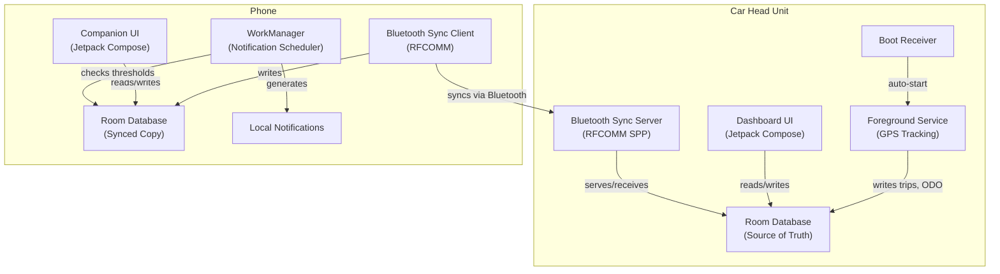
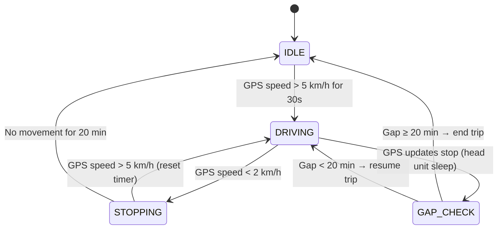

# RoadMate — Open Source Vehicle Maintenance & Trip Tracker

An open source Android app that runs silently on your car's head unit, tracks kilometers via GPS, manages maintenance schedules, records trips, and syncs with a companion phone app — all with **zero cloud dependency**.

## Decisions Made

| Decision | Choice |
|----------|--------|
| ODO tracking | Manual entry first, OBD-II upgrade path later |
| Default car | Mitsubishi Lancer EX 2015 1.6L Gas (multi-car support) |
| Tech stack | Kotlin + Jetpack Compose, min API 29 (Android 10) |
| Data storage | Local Room DB, Bluetooth sync to phone, Google Drive backup in V2 |
| UI behavior | Background service, auto-start on boot, no screen interruption |
| Notifications | Local notifications on phone (no FCM), in-app alerts on head unit |
| Maintenance cycle | 10,000 km base (Egypt standard), template + customizable |
| Trip detection | GPS movement-based, 20-min stationary timeout |
| Maps | OpenStreetMap + osmdroid (fully open source) |
| Sync | Bluetooth Classic RFCOMM (always-on BT link), no internet required |
| OBD-II | Interfaces designed in V1, implementation in V2 |
| Trip sharing | Google Maps URL generation from recorded routes |
| License | Open source, zero cost |

---

## Architecture Overview



**Two Android apps in a multi-module Kotlin project:**
1. `app-headunit` — Background GPS tracker + full dashboard
2. `app-phone` — Companion viewer + local notifications
3. `core` — Shared module (data models, database, repositories, business logic)

---

## Data Model

### Vehicle
```
id, make, model, year, engineType, engineSize, fuelType
currentOdometer, odometerUnit (km/miles)
plateNumber, vin (optional)
cityConsumptionPer100km, highwayConsumptionPer100km
```

### MaintenanceSchedule
```
id, vehicleId, name (e.g., "Oil Change")
intervalKm (e.g., 10000), intervalMonths (e.g., 6)
lastPerformedKm, lastPerformedDate
isCustom (user-added vs template), category
```

### MaintenanceRecord
```
id, vehicleId, scheduleId
performedAtKm, performedAtDate
cost, location, notes, checklistItems[]
```

### Trip
```
id, vehicleId
startTime, endTime, startOdometer, endOdometer
distanceKm, durationMinutes
maxSpeedKmh, avgSpeedKmh
estimatedFuelLiters
```

### TripPoint (route recording)
```
tripId, latitude, longitude, speed, altitude, timestamp
```

### FuelLog
```
id, vehicleId, date, odometerAtFill
liters, pricePerLiter, totalCost, fullTank, station
```

### Document
```
id, vehicleId, type (insurance/license/registration)
expiryDate, reminderDaysBefore, notes
```

### PreTripChecklist
```
id, vehicleId, name, items[], forLongTrips, forDailyDriving
```

---

## Trip Detection Logic



- **Traffic jams**: Speed fluctuates above 2 km/h (creeping) → trip continues
- **Parked with music**: No movement → trip ends after 20 min
- **Head unit sleep**: GPS stops → gap detected on wake → trip boundary
- **Quick errand (<20 min)**: Stays as one trip, splittable manually

---

## Feature Modules

### 1. Dashboard (Home Screen)
- Current vehicle summary card
- ODO reading (manual + GPS-accumulated)
- Next maintenance due (name + remaining km + progress bar)
- Estimated maintenance date (based on daily km average)
- Active alerts (overdue maintenance, expiring documents)
- Quick stats: today's km, this week, this month

### 2. Maintenance Manager
- List of items with visual progress bars (% to next service)
- Tap to see full history of each item
- "Mark as Done" → records current km, date, optional cost/notes
- Add custom maintenance items
- Pre-built templates per car type (10,000 km default)
- **Maintenance prediction**: avg daily km → estimated date for next service

### 3. Trip Recorder
- Auto-records trips via GPS movement detection
- Trip list: date, distance, duration, avg/max speed, est. fuel
- Tap trip → route displayed on OpenStreetMap
- Trip merge/split feature
- Monthly/weekly driving summaries
- Fuel consumption estimate per trip (speed-profile based)
- **Share Route** → generates Google Maps URL with waypoints, shareable via WhatsApp/Telegram/etc.

### 4. Pre-Trip Checklists

**Default daily checklist:**
- [ ] Tires visual check
- [ ] Mirrors adjusted
- [ ] Lights working
- [ ] Fuel level adequate
- [ ] Seatbelt

**Default long trip checklist (>100 km):**
- [ ] Tire pressure checked
- [ ] Oil level checked
- [ ] Coolant level checked
- [ ] Spare tire & jack present
- [ ] Emergency triangle & kit
- [ ] Documents (license, registration, insurance)
- [ ] Phone charger / car charger
- [ ] Water bottles
- [ ] First aid kit
- [ ] Route reviewed

Custom checklists supported. Completion history saved.

### 5. Fuel Tracker
- Log fill-ups: liters, price/liter, odometer, station
- Calculate actual L/100km between fill-ups
- Compare actual vs estimated consumption
- Cost trends (weekly/monthly/yearly)
- Cost per km calculation

### 6. Documents Wallet
- Insurance, license, registration expiry dates
- Configurable reminder (X days before expiry)
- Optional: photo of each document stored locally

### 7. Vehicle Profiles
- Multiple vehicles supported
- Each has its own maintenance schedule, trips, fuel logs
- Quick switch between vehicles

### 8. Statistics & Reports
- Monthly/yearly summaries
- Total km, fuel cost, maintenance cost
- Driving patterns (city vs highway based on speed profile)
- Night driving percentage
- Cost per km trend
- Export to CSV/PDF

---

## Maintenance Template: Lancer EX 2015 1.6L

Based on 10,000 km Egypt service cycle:

| Item | Interval (km) | Interval (months) |
|------|---------------|-------------------|
| Engine Oil + Filter | 10,000 | 6 |
| Air Filter | 20,000 | 12 |
| AC/Cabin Filter | 20,000 | 12 |
| Spark Plugs | 40,000 | 24 |
| Brake Pads (inspect) | 20,000 | 12 |
| Brake Fluid | 40,000 | 24 |
| CVT Transmission Fluid | 40,000 | 24 |
| Coolant | 40,000 | 24 |
| Power Steering Fluid | 60,000 | 36 |
| Timing Chain (inspect) | 100,000 | — |
| Tire Rotation | 10,000 | 6 |
| Battery (check) | 20,000 | 12 |
| Serpentine Belt | 60,000 | 36 |
| Fuel Filter | 40,000 | 24 |
| Wiper Blades | — | 6 |

Fuel estimation: City ~9.5 L/100km, Highway ~6.5 L/100km, Mixed ~8.0 L/100km

---

## Sync Protocol (Head Unit ↔ Phone via Bluetooth)

1. Head unit registers an **RFCOMM SPP service** with a fixed UUID inside the foreground service
2. Phone connects to the **already-bonded** head unit via that UUID — no discovery needed
3. Sync is **bidirectional** with delta sync (only records modified since last sync)
4. Each record has a UUID + `lastModified` timestamp
5. Conflict resolution: **last-write-wins**
6. Protocol: Length-prefixed JSON frames over RFCOMM stream
7. Works over: always-on Bluetooth link between phone and head unit

### Sync Triggers
- **Automatic**: on BT connection established (every drive start)
- **Event-driven**: on trip end, maintenance logged, or fuel entry added
- **Periodic**: every 15 minutes while BT is connected
- **Manual**: user taps "Sync Now" in either app

### Sync Message Format
```
[4 bytes: payload length][JSON payload]

Messages:
  SYNC_STATUS   → { lastSync, recordCounts }
  SYNC_PULL     → { since: timestamp } → response: { records[] }
  SYNC_PUSH     → { records[] } → response: { accepted, conflicts[] }
  SYNC_ACK      → { syncId, completedAt }
```

### Why Bluetooth Over WiFi
- Phone is always BT-paired to head unit (calls, music, Android Auto)
- Zero user action required — sync happens automatically
- No hotspot/WiFi setup needed
- Delta sync payloads are small (KB to low MB) — well within BT Classic throughput (~2-3 Mbps)
- Removes Ktor server/client dependencies — uses built-in Android Bluetooth APIs

---

## Phone Notifications (No Internet Required)

- `WorkManager` periodic job runs every 12 hours
- Checks against synced local data:
  - Maintenance due within 500 km → notification
  - Document expiring within 30 days → notification
  - Weekly summary ready → notification
- All notifications are **local** — no FCM, no internet

---

## Project Structure

```
car-companion/
├── app-headunit/
│   └── src/main/
│       ├── service/        # GPS foreground service
│       ├── ui/             # Compose screens (dashboard, trips, etc.)
│       ├── sync/           # Bluetooth RFCOMM sync server
│       └── boot/           # Boot receiver (auto-start)
├── app-phone/
│   └── src/main/
│       ├── ui/             # Compose screens (companion viewer)
│       ├── sync/           # Bluetooth RFCOMM sync client
│       ├── worker/         # WorkManager notification jobs
│       └── backup/         # Google Drive optional backup
├── core/
│   ├── database/           # Room entities, DAOs, migrations
│   ├── model/              # Domain models
│   ├── repository/         # Data repositories
│   ├── obd/                # OBD-II interfaces (V1 design, V2 implementation)
│   │   ├── OBDProvider.kt  # Interface: readOdometer(), readFuelRate(), etc.
│   │   └── MockOBDProvider.kt  # Stub for V1 (returns null/manual values)
│   ├── templates/          # Car maintenance templates (JSON)
│   └── util/               # Distance calc, fuel estimation, speed analysis
├── build.gradle.kts
└── settings.gradle.kts
```

## Dependencies

| Library | Purpose |
|---------|---------|
| Jetpack Compose + Material 3 | UI framework |
| Room | Local database |
| Hilt | Dependency injection |
| Android Bluetooth API | RFCOMM sync server (head unit) + client (phone) |
| Google Location Services | GPS (FusedLocationProvider) |
| osmdroid | OpenStreetMap display |
| WorkManager | Background notification scheduling (phone) |
| DataStore | Preferences/settings, crash recovery journal |
| Kotlin Serialization | JSON for Bluetooth sync protocol |

---

## Technical Hardening

### GPS Drift Prevention (Indoor/Garage Parking)

Raw GPS can "jump" 5-15 km/h while stationary, especially under concrete. **Multi-gate validation** prevents false trip triggers — all three gates must pass:

| Gate | Check | Threshold |
|------|-------|-----------|
| **Accuracy** | `Location.getAccuracy()` | Must be < 25m (indoor GPS is typically >50m) |
| **Sustained speed** | Consecutive readings > 5 km/h | Minimum 3 readings (~30 seconds) |
| **Displacement** | Actual distance from last parking point | Must be > 50 meters |

No Kalman filter needed for V1. These three gates reject 99%+ of drift scenarios. Kalman smoothing can be added in V2 for cleaner route recording.

### Foreground Service Architecture

**One foreground service hosts both GPS tracker and Bluetooth sync server:**

```
RoadMateService (Foreground Service)
├── GPS Tracker (LocationCallback)         — always active
├── Bluetooth RFCOMM Server (SPP UUID)     — accepts phone connection
├── Trip State Machine (IDLE/DRIVING/STOPPING)
└── Persistent notification: "RoadMate tracking active"
```

- Android protects foreground services from being killed
- RFCOMM server socket is ultra-lightweight when idle (blocking accept = zero CPU)
- Head units have no battery optimization / Doze mode concerns (always on car power)
- BT connection is already established for audio/calls — sync reuses the bonded link
- One notification, one service, clean lifecycle

### Power Loss Data Integrity

Car head units can lose power abruptly. Three-layer protection:

| Layer | Strategy | Max Data Loss |
|-------|----------|---------------|
| **Room WAL mode** | Explicit `JournalMode.WRITE_AHEAD_LOGGING` — more resilient than journal mode | Minimal |
| **TripPoint flush** | Batch GPS points in memory, flush to Room every **10 seconds** | 10 seconds of route points |
| **Crash recovery journal** | Write critical trip summary (distance, ODO, duration) to **DataStore every 30 seconds** | 30 seconds of summary data |

**On boot recovery:**
1. Check for trips with no `endTime` → found = interrupted trip
2. Recover route from last flushed TripPoints
3. Recover distance/ODO from DataStore crash journal
4. Mark trip as `status = INTERRUPTED`, preserve all recovered data

---

## Resolved Decisions

- ✅ **App name**: RoadMate
- ✅ **Google Drive backup**: Deferred to V2
- ✅ **OBD-II**: Interfaces designed in V1 (`OBDProvider` interface + `MockOBDProvider` stub), full Bluetooth ELM327 implementation in V2
- ✅ **Trip sharing**: Google Maps URL generation from recorded trip waypoints

## OBD-II Interface Design (V1 — Interfaces Only)

```kotlin
interface OBDProvider {
    fun isConnected(): Boolean
    suspend fun readOdometer(): Double?        // km
    suspend fun readSpeed(): Double?            // km/h
    suspend fun readRPM(): Int?
    suspend fun readFuelRate(): Double?         // L/h
    suspend fun readCoolantTemp(): Int?         // °C
    suspend fun readBatteryVoltage(): Double?   // V
    suspend fun readDTCCodes(): List<String>    // error codes
}
```

In V1, `MockOBDProvider` returns `null` for everything — the app falls back to GPS speed and manual ODO. When V2 adds the real `BluetoothOBDProvider`, it plugs into the same interface with zero refactoring.

---

## Verification Plan

### Automated Tests
- Unit tests for trip detection state machine
- Unit tests for maintenance prediction calculations
- Unit tests for fuel consumption estimation
- Unit tests for sync conflict resolution
- Instrumented tests for Room database operations

### Manual Verification
- Install on Android 10 head unit, verify boot auto-start
- Drive test: verify trip auto-detection and recording
- Sync test: verify automatic Bluetooth sync when phone connects to head unit
- Battery/resource test: verify background service doesn't drain head unit